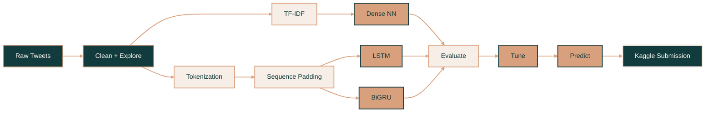

<div id="top"></div>

<br>

<!-- Header Badges -->

<p align="center">

<a href="https://github.com/soph-k">
  
</a>

<a href="https://www.python.org/">
  
</a>

<a href="./LICENSE.txt">
  
</a>

<a href="https://github.com/soph-k/tweet-classification-nlp/commits/main">
  
</a>

<a href="https://github.com/soph-k/tweet-classification-nlp">
  
</a>

</p>

<br>

<!-- Header -->

<div align="center">

<a href="https://github.com/soph-k">
  
</a>

<h2>『 Tweet Classification NLP 』</h2>

<p>
  An NLP and deep learning project comparing TF-IDF, LSTM, and Bidirectional GRU
  models for disaster-related tweet classification.
</p>

<p>────── ♡ ──────</p>

<p>
  <a href="./tweet-classification-nlp.ipynb">
    <strong>View Notebook »</strong>
  </a>
</p>

</div>


<!-- Project Image -->

<p align="center">

<a href="https://raw.githubusercontent.com/soph-k/logo/main/tweet-project.png">
  
</a>

</p>

<p align="center">
  <sub>
    Disaster and non-disaster language patterns with keyword frequency analysis
  </sub>
</p>

<br>

## ❐ Table of Contents

<details>
<summary><strong>Quick Links</strong></summary>

<ol>
  <li><a href="#about">About</a></li>
  <li><a href="#project-highlights">Project Highlights</a></li>
  <li><a href="#workflow">Workflow</a></li>
  <li><a href="#models">Models</a></li>
  <li><a href="#results">Results</a></li>
  <li><a href="#built-with">Built With</a></li>
  <li><a href="#repository-structure">Repository Structure</a></li>
  <li><a href="#getting-started">Getting Started</a></li>
  <li><a href="#license">License</a></li>
</ol>

</details>

<br>

<!-- About -->

<div id="about"></div>

## ❐ About

This project explores **natural language processing for disaster detection in
social-media text** using the Kaggle *Natural Language Processing with Disaster
Tweets* dataset.

The dataset contains **7,613 labeled training tweets** and **3,263 test tweets**.
Each training tweet is classified as either describing a real disaster or containing
unrelated language.

Three neural-network approaches are compared:

- Dense Neural Network with TF-IDF features
- Long Short-Term Memory network
- Bidirectional Gated Recurrent Unit network

The project covers text exploration, preprocessing, numerical representation,
deep-learning model development, hyperparameter experiments, validation, and
Kaggle prediction generation.

> **Project focus:** comparing traditional text features with recurrent neural
> networks while examining generalization and overfitting.

<p align="right">(<a href="#top">back to top</a>)</p>

<br>

<!-- Highlights -->

<div id="project-highlights"></div>

## ❐ Project Highlights

<table width="100%">

<tr>

<td width="50%" valign="top">

### NLP

- Text normalization
- URL and mention removal
- Stopword filtering
- Porter stemming
- TF-IDF vectorization
- Tokenization and padding
- Word-frequency analysis

</td>

<td width="50%" valign="top">

### Deep Learning

- Dense neural-network baseline
- LSTM sequence modeling
- Bidirectional GRU
- Learned word embeddings
- Dropout regularization
- Early stopping
- Hyperparameter tuning

</td>

</tr>

</table>

<br>

<p align="center">


</p>

<p align="center">


</p>

<p align="right">(<a href="#top">back to top</a>)</p>

<br>

<!-- Workflow -->

<div id="workflow"></div>

## ❐ Workflow



### Text Representation

The Dense Neural Network uses a **5,000-feature TF-IDF representation**.

The recurrent models use tokenized sequences with:

```text
Vocabulary:      10,000 words
Sequence length: 100 tokens
```

Tweets are normalized, cleaned, stripped of URLs and mentions, filtered for
stopwords, and processed with Porter stemming before modeling.

<p align="right">(<a href="#top">back to top</a>)</p>

<br>

<!-- Models -->

<div id="models"></div>

## ❐ Models

| Model | Input | Purpose |
|---|---|---|
| **Dense Neural Network** | TF-IDF vectors | Establish a feature-based baseline |
| **LSTM** | Token sequences | Learn sequential dependencies in tweet text |
| **Bidirectional GRU** | Token sequences | Learn context in both sequence directions |

### Training

The labeled dataset is divided into an **80% training** and **20% validation** split.

| Component | Configuration |
|---|---|
| Optimizer | `Adam` |
| Loss | `Binary Cross-Entropy` |
| Output | `Sigmoid` |
| Regularization | `Dropout` |
| Training Controls | `EarlyStopping`, `ReduceLROnPlateau` |

The Bidirectional GRU is also tested with multiple embedding dimensions and batch
sizes to examine how architecture choices affect validation performance.

<p align="right">(<a href="#top">back to top</a>)</p>

<br>

<!-- Results -->

<div id="results"></div>

## ❐ Results

| Model | Validation Accuracy |
|---|---:|
| **Dense Neural Network + TF-IDF** | `79.32%` |
| **LSTM** | `78.66%` |
| **Bidirectional GRU** | `78.79%` |
| **Best BiGRU Tuning Trial** | **`80.43%`** |

The strongest Bidirectional GRU experiment used:

```text
Embedding Dimension: 256
Batch Size:           16
Validation Accuracy:  80.43%
```

The Dense Neural Network remained competitive with the recurrent models despite
using the simpler TF-IDF representation. The recurrent architectures achieved
stronger training performance than validation performance, highlighting
**overfitting** as an important limitation.

### Kaggle Submission

The final predictions received a public Kaggle leaderboard score of:

<p align="center">


</p>

> A more complex architecture did not automatically produce better generalization,
> emphasizing the importance of validation rather than training accuracy alone.

<p align="right">(<a href="#top">back to top</a>)</p>

<br>

<!-- Built With -->

<div id="built-with"></div>

## ❐ Built With

<p align="center">
  
  
  
  
  
  
  
  
</p>

<p align="center">
  <sub>
    NLP • Deep Learning • Text Classification • LSTM • Bidirectional GRU
  </sub>
</p>

<p align="right">(<a href="#top">back to top</a>)</p>


<!-- Repository Structure -->

<div id="repository-structure"></div>

## ❐ Repository Structure

```text
tweet-classification-nlp/
│
├── assets/
├── data/
├── outputs/
│   └── submission.csv
│
├── tweet-classification-nlp.ipynb
├── LICENSE.txt
├── README.md
└── requirements.txt
```

`tweet-classification-nlp.ipynb` contains the complete exploratory analysis,
preprocessing, model training, evaluation, tuning, and prediction workflow.

<p align="right">(<a href="#top">back to top</a>)</p>

<br>

<!-- Getting Started -->

<div id="getting-started"></div>

## ▹ Getting Started

### ❐ Installation

Clone the repository:

```bash
git clone https://github.com/soph-k/tweet-classification-nlp.git
cd tweet-classification-nlp
```

Create and activate a virtual environment:

```bash
python -m venv .venv
```

**Windows**

```powershell
.venv\Scripts\Activate.ps1
```

**macOS / Linux**

```bash
source .venv/bin/activate
```

Install the dependencies:

```bash
pip install -r requirements.txt
```

Launch Jupyter:

```bash
jupyter notebook
```

Then open:

```text
tweet-classification-nlp.ipynb
```

<p align="right">(<a href="#top">back to top</a>)</p>

<br>

<!-- License -->

<div id="license"></div>

## ▹ License

Distributed under the **MIT License**. See [`LICENSE.txt`](./LICENSE.txt) for details.

<p align="right">(<a href="#top">back to top</a>)</p>

<br>

---

<div align="center">

<p>────── ♡ ──────</p>

<sub>
✦ Process language ✦ Learn context ✦ Classify meaning ✦
</sub>

<br><br>

<a href="#top">
  <strong>Back to Top ↑</strong>
</a>

</div>